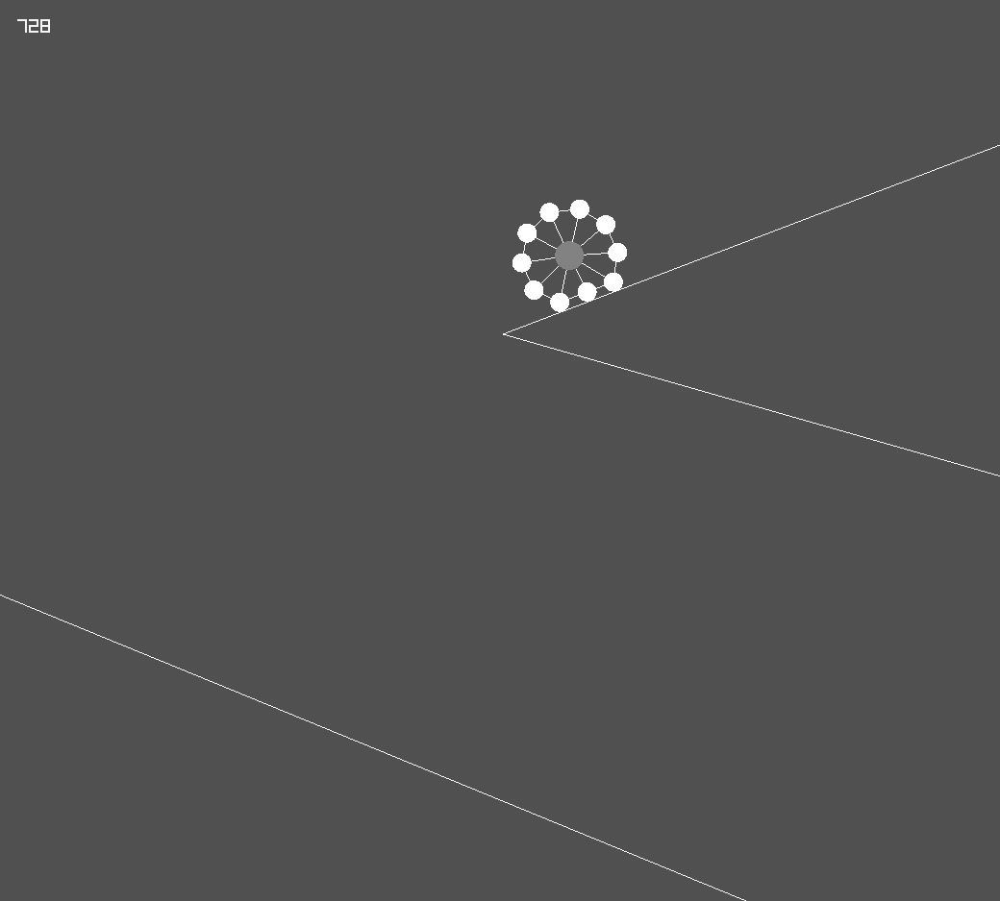

## Soft Body Simulation

This is an experiemental simulation made using Radius2D.

This simply is a Simulation having a Circle in the center and few more Circles around that and all the circles are connected through Springs which gives it Soft Body Effect.

    

### Tweaking the Properties

To tweak the properties of the Soft Body you can change the value of few variables and notice the effect on the simulation.

`numOfCircs` is an integer for Number of Circles around the Central Circle.

`radie` is a float for the radius (or distance between Central Circle and Other Circles) of Main Soft Body.

`centerOfCirc` is the Central Circle, you can tweak it's properties on that same line.

`springStrength` is float for the overall Strength of the Springs connecting the Circles. It's orignal value will be used as Stiffness of Springs, and one-third of it will be used as Damping Factor of those Springs.

`radiusOfCircs` is a float for the Radius of Circles other than Central Circle.