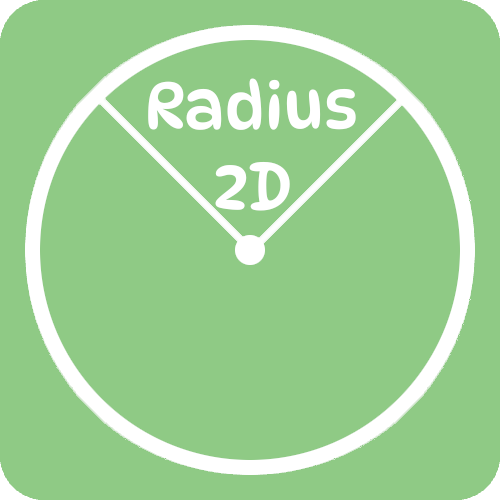
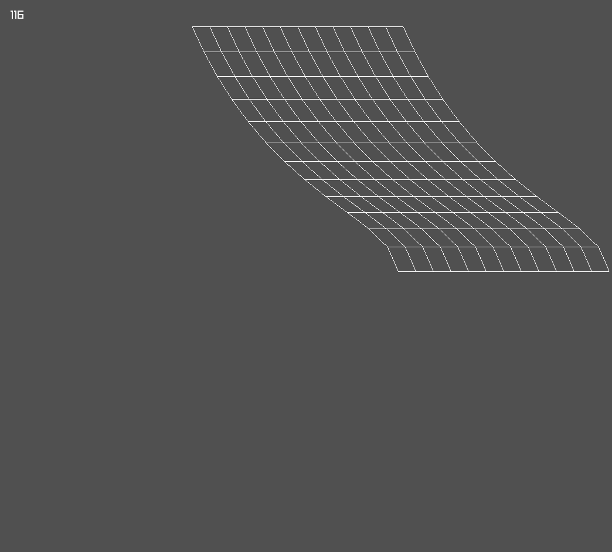
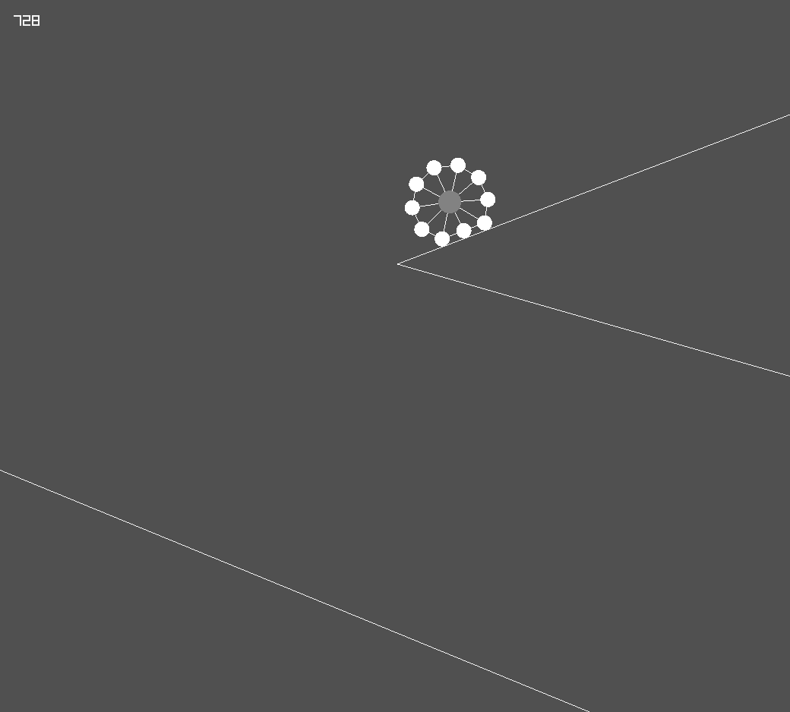

<p align="center">
    <a href="https://github.com/MIJGames/radius2D">
        
    </a>
</p>

# Radius2d

Radius2D is an experimental Physics Engine implementation.
It uses [Raylib](https://github.com/raysan5/raylib) for rendering and Keyboard Input purposes. It was once written in C++, but now have been changed into C# for having better Object-Oriented approach and more sophisticated Vector Calculations. It currently is in the early-development stages.
As it now have been shifted into C#, it use [Raylib_cs](https://github.com/ChrisDill/Raylib-cs) which basically is a C# wrapper for Raylib.


## How To Install

To use this, you need the .NET SDK, if you don't have you can [download](https://dotnet.microsoft.com/en-us/download) from here.

Install the [MIJGames.Radius2D](https://www.nuget.org/packages/MIJGames.Radius2D) Nuget Package.

## Examples

<p align="center">
    <a href="https://github.com/MIJGames/radius2D/Examples/ClothSimulation">
        
    </a>
    <a href="https://github.com/MIJGames/radius2D/Examples/SoftBodySimulation">
        
    </a>
</p>

 - Cloth Simulation
 - Soft Body Simulation

## How to Use

You need to include Radius2D and Raylib_cs in your ``Program.cs`` file.
```cs
using Raylib_cs;
using Radius2D;
```
Now you need to initialize the Physics Layer
```cs
var Layer = new PhysicsLayer();
```
You can now add Circles, Lines and Springs in the Lists of your Physics Layer,
```cs
// Adding Circles in the Physics Layer
for (int i = 0; i < 10; i++)
{
    int posX = Raylib.GetRandomValue(0, 1920);
    int posY = Raylib.GetRandomValue(0, 1080);

    var Circ = new Circle(posX, posY, 0, 0, 15, 20, 1.0f, Color.WHITE);

    Layer.circles.Add(Circ);
}
```
```cs
// Adding Lines in the Physics Layer
var line01 = new Line(Width, 0, 0, 0);
Layer.lines.Add(line01);
var line02 = new Line(0, 0, 0, Height);
Layer.lines.Add(line02);
var line03 = new Line(Width, 0, Width, Height);
Layer.lines.Add(line03);
var line04 = new Line(0, Height, Width, Height);
Layer.lines.Add(line04);
```
```cs
// Adding Springs in the Physics Layer
var link01 = new Spring(Layer.circles[0], Layer.circles[1], 70.0f, 20, 10);
Layer.springs.Add(link01);
var link02 = new Spring(Layer.circles[1], Layer.circles[2], 70.0f, 20, 10);
Layer.springs.Add(link02);
var link03 = new Spring(Layer.circles[2], Layer.circles[0], 70.0f, 20, 10);
Layer.springs.Add(link03);
```
Now you just need to Update the Physics in the Main Loop
```cs
Layer.Update(deltaTime);
```
And Draw it in Rendering section of the Main Loop,
```cs
Layer.Draw();
```
This is pretty much it, You can have a look at the Examples. There are currently only two examples, Soft Body Simulation in ``Examples/SoftBodySimulation`` and Cloth Simulation in ``Examples/ClothSimulation``.

if any kind of help regarding this is needed, you can just [mail me](mailto:ishaquejunejo33+radius2d@gmail.com).

## License

Radius2D is under the [MIT License](https://github.com/MIJGames/Radius2D/LICENSE) which is why you can do almost anything with projects made with it you want.