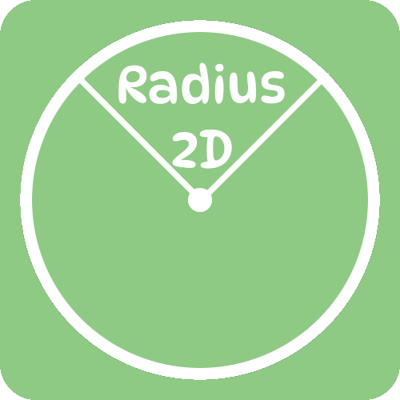

    

# Radius2d

Radius2D is an experimental Physics Engine implementation.
It uses [Raylib](https://github.com/raysan5/raylib) for rendering and Keyboard Input purposes. It was once written in C++, but now have been changed into C# for having better Object-Oriented approach. It currently is in the early-development stages.
As it now have been shifted into C#, it use [Raylib_cs](https://github.com/ChrisDill/Raylib-cs) which basically is a C# wrapper for Raylib.

## Compile

To compile this, you need the .NET Framework and simply execute ``dotnet run`` in the ``/radius2D`` directory.
