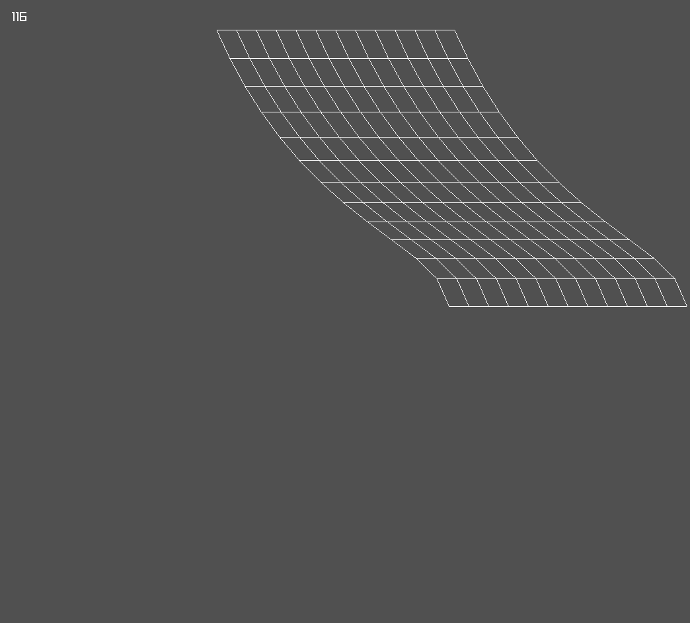
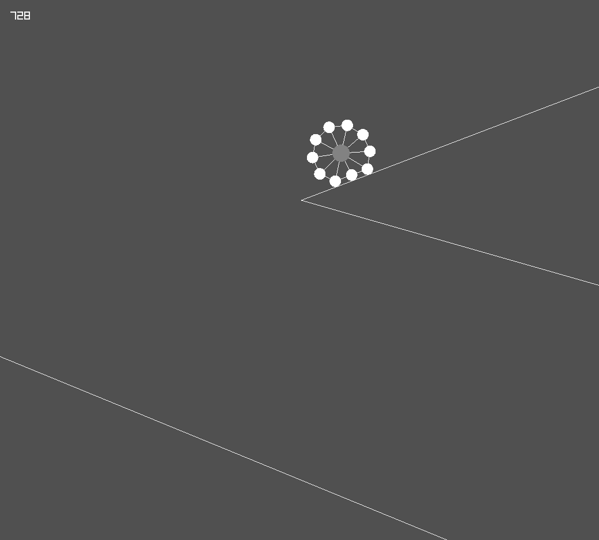

    

# Radius2d

Radius2D is an experimental Physics Engine implementation.
It uses [Raylib](https://github.com/raysan5/raylib) for rendering and Keyboard Input purposes. It was once written in C++, but now have been changed into C# for having better Object-Oriented approach and more sophisticated Vector Calculations. It currently is in the early-development stages.
As it now have been shifted into C#, it use [Raylib_cs](https://github.com/ChrisDill/Raylib-cs) which basically is a C# wrapper for Raylib.

## How To Use

To use this, you need the .NET SDK, if you don't have you can [download](https://dotnet.microsoft.com/en-us/download) from here.

Clone this repo and execute ``dotnet run`` in the ``Radius2D/Source`` directory.

## Examples

    
    

#### Cloth Simulation

This is a sample simulation of Radius2D,

This Cloth Simulation is made by having few Circles ( with radius 0 ) being placed and connected with springs. Which is why it is not a normal cloth simulation but an Elastic Cloth Simulation.

It also have Mouse inputs for Simulating Wind Effects,

- Hold Left Mouse Button for Wind to blow from Left.
- Hold Right Mouse Button for Wind to blow from Right.

#### Soft Body Simulation

This is also a sample simulation of Radius2D,

This simply is a Soft Body Simulation having a Circle in the center and few more Circles around that and all the circles are connected through Springs which gives it Soft Body Effect.

## License

Radius2D is under the [MIT License](https://github.com/MIJGames/Radius2D/LICENSE) which is why you can do almost anything with projects made with it you want.